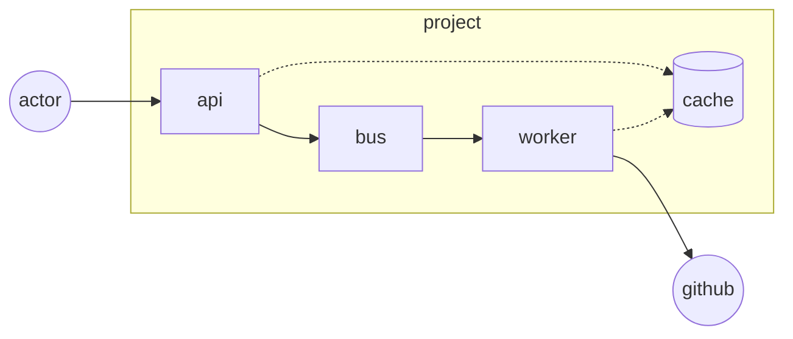
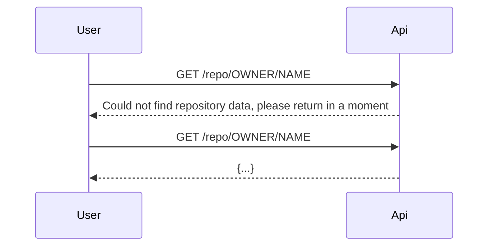
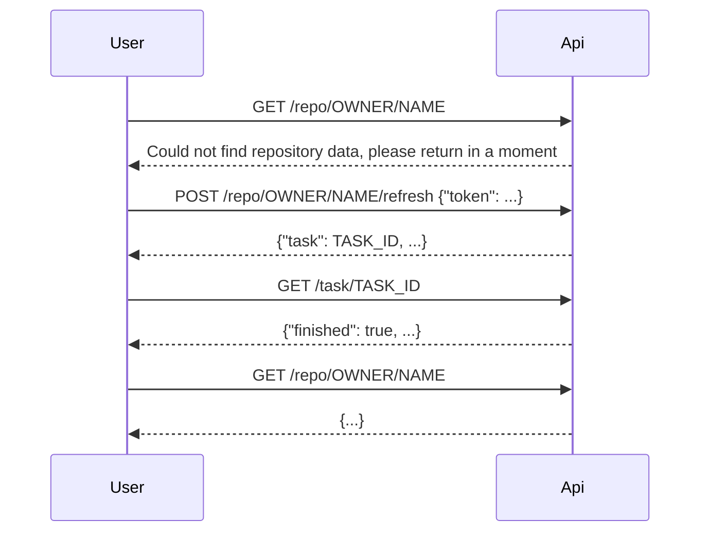

# Git Check Alive

Educational project to gather data about GitHub projects.

## Components

1. API tries to get data from Cache, then falls back to publishing refresh task via Bus
1. Worker listens for Bus and gather data from GitHub API upon receiving appropriate task



## Sample scenarios

### Background refresh



### Force refresh



## Local usage

```
$ docker-compose up --build
$ http 127.0.0.1:8081/repo/nodejs/node/refresh token=YOUR_GITHUB_TOKEN
$ http 127.0.0.1:8081/repo/nodejs/node
```
